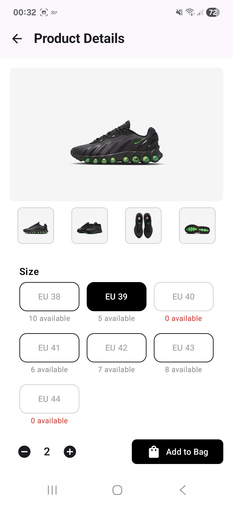

# SneakerPuzz Shop — Android E-commerce App
SneakerPuzz Shop is an e-commerce app for Android, built with Jetpack Compose and using Firebase as the backend. The app supports Google login, product browsing, shopping cart, checkout, favorites, search and more. (client-side only)
# 📱Screenshots
      
     
  
    
       
   
  
 
 
              
 
      
    
# 🌟 Features
- 🔐 **Authentication**
  - Sign up, log in, and reset password functionality
  - Sign in with Google account (Firebase Authentication)
  - Persistent user session & account deletion
- 🛍️ **Product Display**
  - View top-selling sneakers and promotional banners
  - Browse products by category
  - View detailed product information and customer reviews
- 🔎 **Search & Filter**
  - Search products by name
  - Filter by price range and available sizes
- ❤️ **Favorites**
  - Add/remove favorite products
  - Favorites synced with your user account in real time
- 🛒 **Cart Management**
  - Add items to cart and update quantity
  - Remove items from cart seamlessly
- 📦 **Order Management**
  - Track and cancel orders
- 💳 **Checkout**
  - Complete your purchase using ZaloPay Sandbox API integration
- 🌙 **Dark Mode**
  - Fully responsive and supports system-wide dark theme
- 👤 **User Profile**
  - Edit personal information
  - Upload avatar via camera or photo gallery
- 📧 **Support**
  - Send support requests via email directly from the app
# 🛠️ Tech Stack
  - Programming Language: [Kotlin](https://kotlinlang.org/)
  - Architecture: [MVVM](https://viblo.asia/p/tim-hieu-ve-mo-hinh-mvvm-maGK7vW95j2) with [Clean Architecture](https://viblo.asia/p/clean-architecture-Ljy5VMYzlra)
  - UI: [Jetpack Compose](https://developer.android.com/compose), [Material 3](https://m3.material.io/)
  - Dependency Injection: [Dagger Hilt](https://www.youtube.com/watch?v=bbMsuI2p1DQ)
  - Database: [Firebase](https://firebase.google.com/)
  - Preferences Storage: [DataStore](https://developer.android.com/topic/libraries/architecture/datastore?hl=vi)
  - Networking: [Retrofit](https://www.youtube.com/watch?v=t6Sql3WMAnk&t=1072s), OkHttp
  - Integrated API: [Cloudinary API](https://cloudinary.com/documentation/image_upload_api_reference)
  - Authentication: [Firebase Auth](https://firebase.google.com/)
  - Cloud Sync: [Cloud Firestore](https://firebase.google.com/)
  - Image Loading: [Coil](https://coil-kt.github.io/coil/compose/)
  - Navigation: [Jetpack Navigation Compose](https://developer.android.com/develop/ui/compose/navigation)
  - Asynchronous: [Kotlin Coroutines](https://developer.android.com/kotlin/coroutines?hl=vi), [Flow](https://www.youtube.com/watch?v=wurR2PCNgxE&list=PLy1MhTvkr6qKZqWzBZfUjcrBQuUwx-410)
# 🏗️ Package Structure
```
com.example.sneakerpuzzapp/
  ├── di/ 
  ├── common/
  ├── data/        
  │   ├── repository/
  │   └── datastore/
  ├── domain/
  │   ├── model/
  │   ├── repository/
  │   └── usecase/
  ├── presentation/
  │   ├── components/
  │   ├── navigation/
  │   ├── ui/
  │   │   ├── auth/
  │   │   ├── home/
  │   │   ├── product/
  │   │   ├── cart/
  │   │   ├── category/
  │   │   ├── checkout/
  │   │   ├── craft/
  │   │   ├── filter/
  │   │   ├── pages/
  │   │   ├── profile/
  │   │   ├── review/
  │   │   ├── search/
  │   │   ├── Splash/
  │   │   ├── thankyou/
  │   │   ├── order/
  │   │   └── profile/
  │   └── viewmodel/
  ├── utils/
  ├── zalopay/
  ├── SneakerPuzzApplication.kt
  └── MainActivity.kt
```
# 🚀 Getting Started
- Prerequisites
  - Android Studio Meerkat | 2024.3.2 or latest version.
  - JDK 11+.
  - Android SDK API 24+.
  Installation
- Clone Repository: git clone ```https://github.com/dungnguyen021203/SneakerPuzzApp.git```
  - Fỉrebase Configuration:
    - Create a new Firebase project.
    - Add an Android app with package name: ```com.dungnguyen021203.sneakerpuzzapp```
    - Authentication and fingerprint. Checkout yt vid [here](https://www.youtube.com/watch?v=WFTsyOKMUKU&t=3s) 
    - Download the ```google-services.json``` file and place it in the app/ folder.
  - Cloudinary
    - Create a product environment and API in your settings (just copy YOUR_PRESET)
- Build and run
- Heleper youtube videos (drop a like)
  - [Easy Tuto](https://www.youtube.com/watch?v=Yv9AGakWoaM&list=PLgpnJydBcnPCHNvEiYHZ4PoIlbyE5i-fH&index=16)
  - [UI](https://www.youtube.com/watch?v=p0-fcBDJ8go)
  - [BottomSheet](https://www.youtube.com/watch?v=UuXD7ahQhhg)
  - [Camera and Gallery](https://www.youtube.com/watch?v=qTCLvLxCN-c)
  - [UI Lover](https://www.youtube.com/watch?v=PtBiFPYnUWE&t=4246s)
# 🤝 Contributing
Contributions are welcome! Please follow these steps:
  - Fork the repository.
  - Create a new branch: git checkout -b feature/your-feature
  - Commit your changes: git commit -am 'Add some feature'
  - Push to the branch: git push origin feature/your-feature
  - Open a pull request.
# 📝 License
This project is developed for educational and personal purposes.
